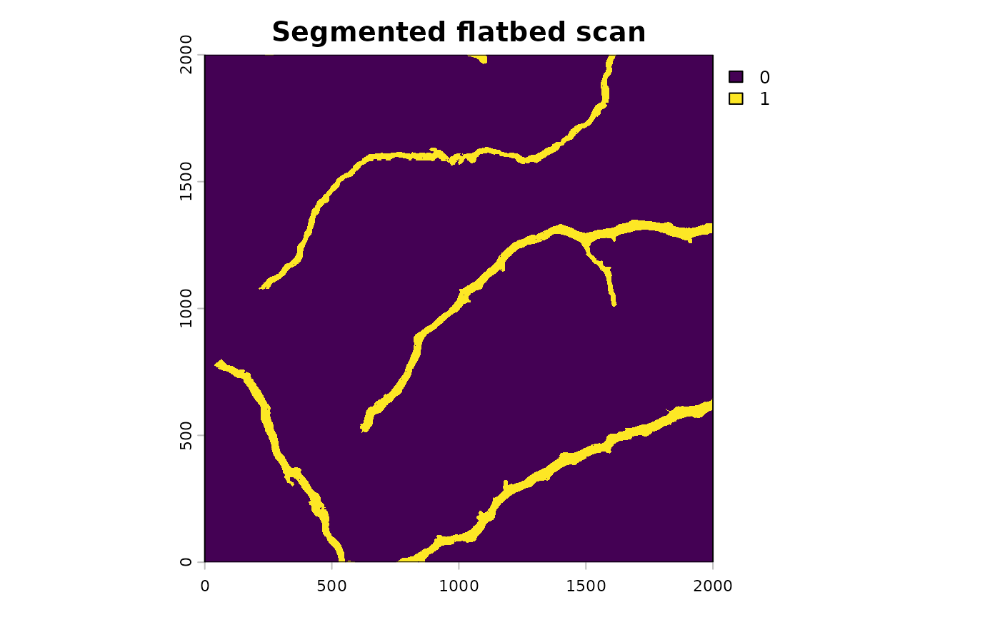
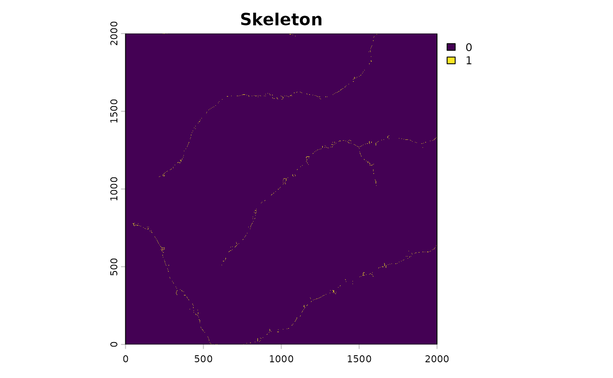
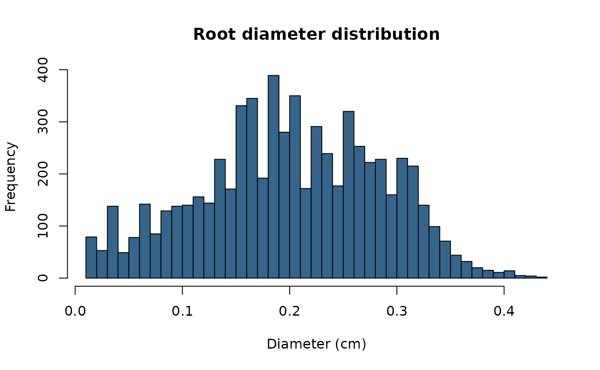

# Analyzing Root Traits from Flatbed Scans with RootScanR in R

## Analyzing Root Systems from Flatbed Scans

### Introduction

Flatbed scanning captures root morphology in a 2D plane with high
resolution and controlled lighting. Unlike minirhizotron images, flatbed
scans have no depth dimension — the full root system is visible at once
and traits are computed globally rather than per depth bin.

This vignette covers the individual-function workflow for flatbed
images. If you are working with minirhizotron tubes and want a
single-call batch approach, see the [Batch
Processing](https://jcunow.github.io/RootScanR/articles/BatchProcessing_vignette.md)
vignette instead.

> **Prerequisite**: RootScanR works with already-segmented images (root
> = 1, background = 0). Segmentation must be done beforehand using
> [RootDetector](https://github.com/ExPlEcoGreifswald/RootDetector) or
> [RootPainter](https://github.com/Abe404/root_painter).

### Installation

``` r

# install.packages("remotes")
# remotes::install_github("jcunow/RootScanR")

library(RootScanR)
library(terra)
library(tidyverse)
```

------------------------------------------------------------------------

### Workflow

#### 1. Load images

[`load_flexible_image()`](https://jcunow.github.io/RootScanR/reference/load_flexible_image.md)
accepts rasters, arrays, file paths, and most common image formats. The
`scale` argument controls value rescaling: `"binary"` forces 0/1,
`"to_01"` maps 0-255 down to 0-1, `"to_255"` maps 0-1 up to 0-255, and
`"none"` leaves values untouched. This is how you load your own files:

``` r

# Segmented image (binary: root = 1, background = 0)
seg <- load_flexible_image(
  "path/to/segmented_scan.tif",
  output_format = "spatrast",
  scale         = "binary",
  select.layer  = 2        # RootDetector: layer 2 is the root channel
)

# Original RGB scan for colour analysis
rgb <- load_flexible_image(
  "path/to/rgb_scan.tif",
  output_format = "spatrast",
  scale         = "none"
)
```

For this vignette we use the bundled example flatbed scan so every step
below runs. It is a 3-band segmentation; layer 2 is the root channel.

``` r

data(flatbed_scan_example)
seg <- terra::rast(flatbed_scan_example)
seg <- terra::ifel(seg[[2]] > 0, 1, 0)   # binarized root channel (0/1)

terra::plot(seg, main = "Segmented flatbed scan")
```



------------------------------------------------------------------------

#### 2. Skeletonize

[`skeletonize_image()`](https://jcunow.github.io/RootScanR/reference/skeletonize_image.md)
reduces roots to single-pixel-wide centrelines. This is required for
root length (Kimura method) and diameter estimation.

``` r

# `seg` is already the single root layer, so no select.layer needed here
skl <- skeletonize_image(seg, verbose = FALSE)

terra::plot(skl, main = "Skeleton")
```



[`skeletonize_image()`](https://jcunow.github.io/RootScanR/reference/skeletonize_image.md)
uses a LUT-based Zhang-Suen thinning algorithm to reduce the segmented
mask to one-pixel-wide centrelines.

------------------------------------------------------------------------

#### 3. Root length

[`root_length()`](https://jcunow.github.io/RootScanR/reference/root_length.md)
uses Kimura’s formula, which weights orthogonal and diagonal skeleton
segments differently to approximate true path length.

``` r

rl <- root_length(skl, unit = "cm", dpi = 300, select.layer = NULL,
                  show_messages = FALSE)
cat("Total root length:", round(rl, 2), "cm\n")
#> Total root length: 56.46 cm
```

------------------------------------------------------------------------

#### 4. Root diameter

[`root_diameter()`](https://jcunow.github.io/RootScanR/reference/root_diameter.md)
estimates local root width from the distance transform. It returns a
diameter raster and the raw diameter values.

``` r

diam_result <- root_diameter(
  seg,
  skeleton.img    = skl,
  skeleton_method = "MAT",
  select.layer    = NULL,
  unit            = "cm"
)

# Summary statistics
diam_vals <- terra::values(diam_result$diameter_rast, na.rm = TRUE)
cat(sprintf(
  "Diameter — mean: %.3f cm  SD: %.3f cm  max: %.3f cm\n",
  mean(diam_vals), sd(diam_vals), max(diam_vals)
))
#> Diameter — mean: 0.201 cm  SD: 0.084 cm  max: 0.432 cm

# Distribution
hist(diam_vals,
     breaks = 40,
     xlab   = "Diameter (cm)",
     main   = "Root diameter distribution",
     col    = "steelblue4")
```



For fine/coarse root separation,
[`modal_peaks()`](https://jcunow.github.io/RootScanR/reference/modal_peaks.md)
can find diameter modes in the distribution:

``` r

peaks <- modal_peaks(
  diam_vals,
  display_type         = "density",
  prominence_threshold = length(diam_vals) / sqrt(length(diam_vals)),
  mclust               = FALSE
)
cat("Diameter peaks at (cm):", paste(round(peaks$peak_x, 3), collapse = ", "), "\n")
```

------------------------------------------------------------------------

#### 5. Pixel counts and area coverage

``` r

root_px <- count_pixels(seg)
void_px <- count_pixels(abs(seg - 1))

root_area_pct <- root_px / (root_px + void_px) * 100
cat(sprintf("Root area coverage: %.2f %%\n", root_area_pct))
#> Root area coverage: 5.16 %

# Root length density (cm root per cm² scan area)
scan_area_cm2 <- (root_px + void_px) / (300 / 2.54)^2
rl_density    <- rl / scan_area_cm2
cat(sprintf("Root length density: %.4f cm / cm²\n", rl_density))
#> Root length density: 0.1969 cm / cm²
```

------------------------------------------------------------------------

#### 6. Branching structure

[`detect_skeleton_points()`](https://jcunow.github.io/RootScanR/reference/detect_skeleton_points.md)
classifies skeleton pixels into endpoints (root tips) and branching
points (forks).

``` r

# `skl` is a single-layer skeleton, so no select.layer is needed
pts <- detect_skeleton_points(skl, select.layer = NULL)

n_tips    <- count_pixels(pts$endpoints)
n_forks   <- count_pixels(pts$branching_points)
branch_freq <- n_forks / rl * 100   # branching points per 100 cm

# count_pixels() returns a numeric, so coerce to integer for %d formatting
cat(sprintf("Root tips: %d\n", as.integer(n_tips)))
#> Root tips: 1285
cat(sprintf("Branching points: %d\n", as.integer(n_forks)))
#> Branching points: 273
cat(sprintf("Branching frequency: %.1f per 100 cm\n", branch_freq))
#> Branching frequency: 483.5 per 100 cm
```

------------------------------------------------------------------------

#### 6b. Branch order (main axis vs. laterals)

[`branch_order_map()`](https://jcunow.github.io/RootScanR/reference/branch_order_map.md)
goes one step further than
[`detect_skeleton_points()`](https://jcunow.github.io/RootScanR/reference/detect_skeleton_points.md):
it builds a full segment graph from the skeleton and classifies every
segment by **branch order** — the thickest, most central root is order 1
(the main axis), its laterals are order 2, their laterals order 3, and
so on. Because flatbed scans have no depth dimension, this is computed
once for the whole image.

``` r

order_res <- branch_order_map(
  skel  = skl,    # skeleton from step 2
  mask  = seg,    # filled root mask, same grid — used for diameters
  order = "branch_order",
  unit  = "cm",
  dpi   = 300
)

# One row per order class: total length, mean diameter, tips, branch points
order_res$summary

# Rasterised branch-order classes, aligned to the skeleton
plot(order_res$class_map, main = "Branch order")
```

[`order_metrics()`](https://jcunow.github.io/RootScanR/reference/order_metrics.md)
can split the architecture into the main root(s) versus all laterals
(selected by diameter, so it works regardless of how many order classes
were found):

``` r

main_vs_lateral <- order_metrics(order_res, focal = "thickest")
print(main_vs_lateral)

# Fraction of total root length that is lateral (order >= 2)
lateral_length_fraction <- main_vs_lateral$length_fraction[main_vs_lateral$group == "rest"]
```

[`order_metrics()`](https://jcunow.github.io/RootScanR/reference/order_metrics.md)
also accepts a numeric `focal` to split one specific order class off
from the rest:

``` r

# Per-order-class table (same as order_res$summary)
order_metrics(order_res)

# Order 1 (main root) vs. everything else
order_metrics(order_res, focal = 1)
```

To check the classification visually, write a colour-coded overlay PNG,
or re-plot a sub-window at native resolution for QC:

``` r

order_res2 <- branch_order_map(
  skel          = skl,
  mask          = seg,
  order         = "branch_order",
  unit          = "cm",
  dpi           = 300,
  overlay_png   = "branch_order_overlay.png",
  keep_segments = TRUE
)

# Zoom into a 200x200 px window at 3x magnification
plot_order_window(
  order_res2$edges, skl,
  r_range = c(100, 300), c_range = c(100, 300),
  scale = 3, file = "branch_order_window.png"
)
```

> **For more control** over crossing resolution, pruning of weak tips,
> and the continuation rule used to group segments into roots, see
> [`?root_graph_pipeline`](https://jcunow.github.io/RootScanR/reference/root_graph_pipeline.md)
> (the engine behind
> [`branch_order_map()`](https://jcunow.github.io/RootScanR/reference/branch_order_map.md)).

------------------------------------------------------------------------

#### 7. Root-level landscape metrics

[`root_scape_metrics()`](https://jcunow.github.io/RootScanR/reference/root_scape_metrics.md)
applies landscape ecology metrics to the binary root image, treating
roots as “patches”. Useful for characterising spatial complexity and
connectivity.

``` r

lsm <- root_scape_metrics(
  img     = seg,
  indexD  = NA,          # no depth index for flatbed scans
  metrics = c("lsm_c_ca", "lsm_c_np", "lsm_c_enn_mn",
              "lsm_c_area_mn", "lsm_l_ent")
)
print(lsm)
```

------------------------------------------------------------------------

#### 8. Colour analysis

[`tube_coloration()`](https://jcunow.github.io/RootScanR/reference/tube_coloration.md)
extracts mean chromatic coordinates and HSV values from an RGB image. On
flatbed scans this characterises overall root pigmentation.

``` r

# Root pixels only
rgb_roots <- rgb
rgb_roots[seg == 0] <- NA
root_colour <- tube_coloration(rgb_roots)
print(root_colour)

# Background (soil / petri dish) pixels
rgb_bg <- rgb
rgb_bg[seg == 1] <- NA
bg_colour <- tube_coloration(rgb_bg)
print(bg_colour)
```

------------------------------------------------------------------------

#### 9. Collecting results

``` r

results <- data.frame(
  sample_id          = "my_scan",
  root_length_cm     = rl,
  root_area_pct      = root_area_pct,
  rl_density_cm_cm2  = rl_density,
  n_tips             = n_tips,
  n_forks            = n_forks,
  branching_freq     = branch_freq,
  mean_diameter_cm   = mean(diam_vals),
  sd_diameter_cm     = sd(diam_vals),
  lateral_length_fraction = lateral_length_fraction,
  n_root_orders      = max(order_res$edges$branch_order, na.rm = TRUE)
)

write.csv(results, "flatbed_results.csv", row.names = FALSE)
```

------------------------------------------------------------------------

### What to read next

- [Minirhizotron
  Scans](https://jcunow.github.io/RootScanR/articles/MinirhizotronScans_vignettes.md)
  — adds depth mapping and per-bin analysis to the individual-function
  workflow
- [Batch
  Processing](https://jcunow.github.io/RootScanR/articles/BatchProcessing_vignette.md)
  — wraps depth-resolved analysis into a single function call
- [Function
  reference](https://jcunow.github.io/RootScanR/reference/index.md) —
  full documentation for every exported function
