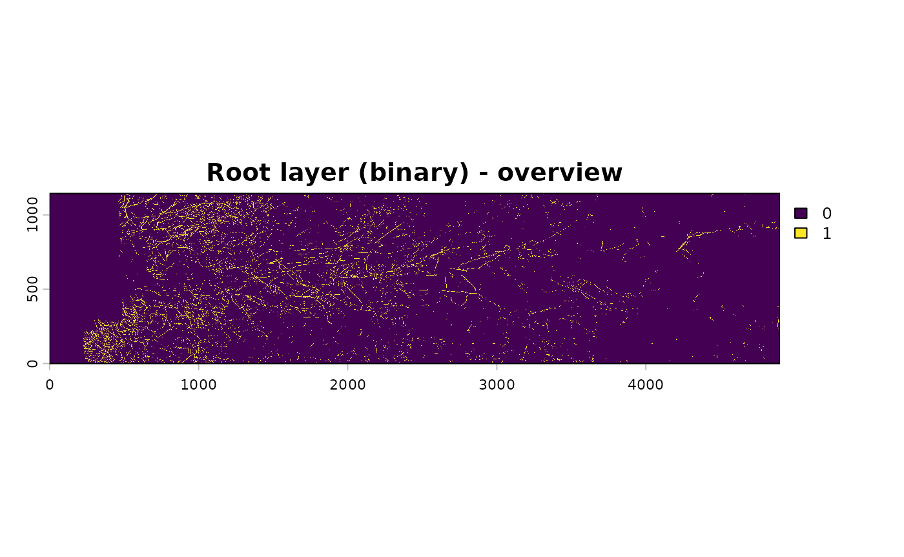
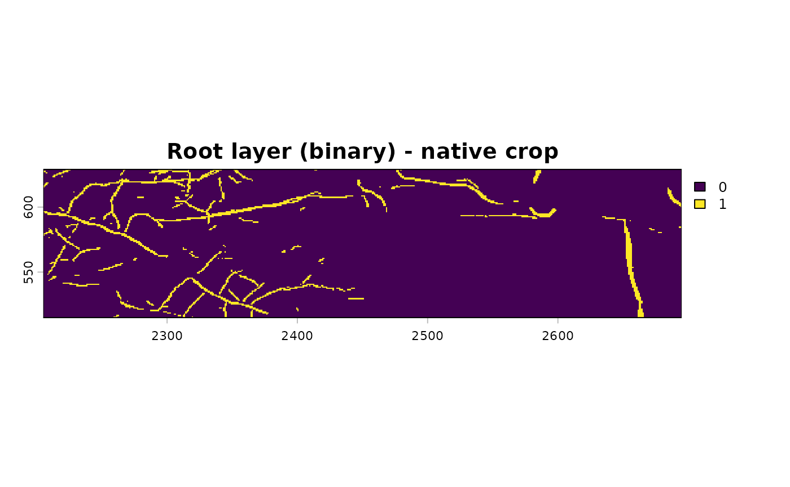
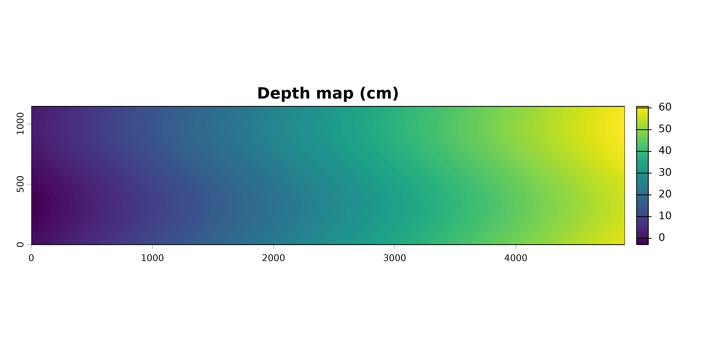
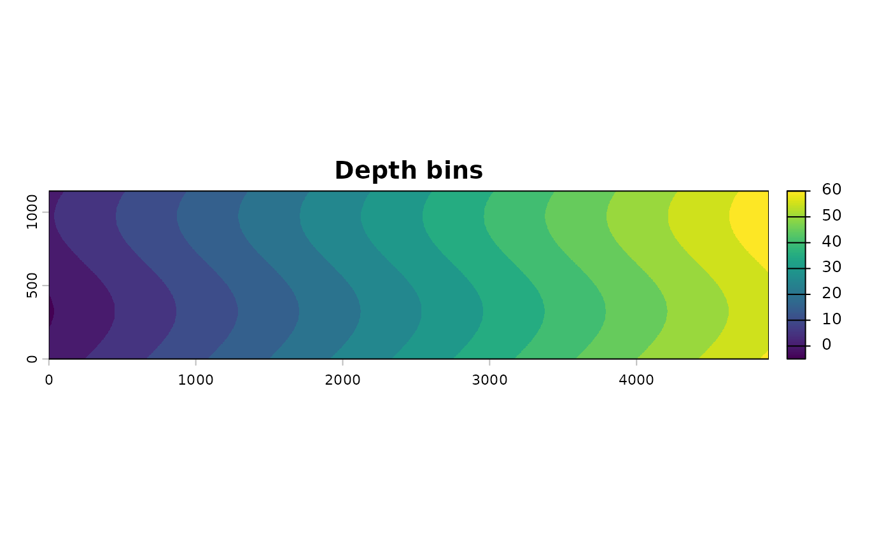
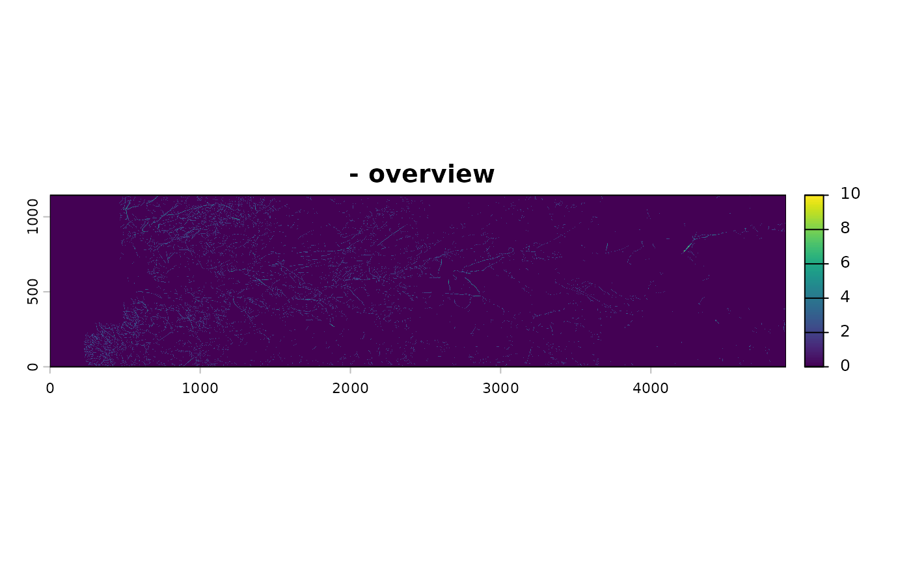
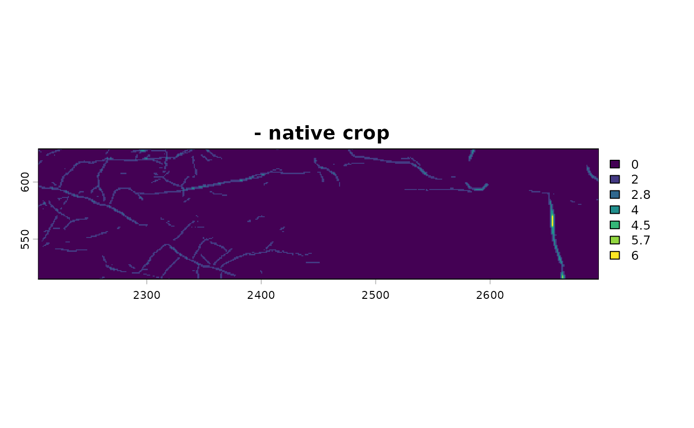
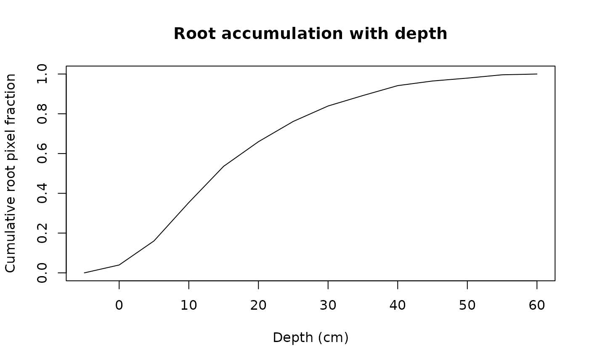

# Minirhizotron Scans Analysis with Rootopia in R

## Minirhizotron Scans Analysis with Rootopia

### Introduction

This vignette walks through the individual-function workflow for
analyzing minirhizotron images — loading, calibrating, depth-mapping,
and extracting root traits step by step. It is aimed at users who want
full control over each processing stage or who are working on a specific
subset of functions.

> **New to Rootopia?** If you want to process a whole set of images in
> one go, the [Batch
> Processing](https://jcunow.github.io/Rootopia/articles/BatchProcessing_vignette.md)
> vignette wraps this entire workflow into a single
> [`root_depth_metrics()`](https://jcunow.github.io/Rootopia/reference/root_depth_metrics.md)
> call. Start there.

> **Prerequisite**: Rootopia works with already-segmented images.
> Segmentation must be done beforehand using
> [RootDetector](https://github.com/ExPlEcoGreifswald/RootDetector) or
> [RootPainter](https://github.com/Abe404/root_painter).

> If a tube constitues of multiple overlapping images, consider
> stitching [Image
> Stitching](https://jcunow.github.io/Rootopia/articles/Stitching_vignette.md)

### Installation

``` r

# install.packages("remotes")
# remotes::install_github("jcunow/Rootopia")

library(Rootopia)
library(terra)
library(tidyverse)
```

------------------------------------------------------------------------

### Workflow overview

0.  (Image Stitching & Segmentation, see: [Image
    Stitching](https://jcunow.github.io/Rootopia/articles/Stitching_vignette.md))
1.  Load images
2.  (Optional) Rotation censor — align field of view across sessions
3.  Create depth map
4.  Bin depths
5.  Extract root traits per depth bin (pixels, length, diameter)
6.  Compute landscape and color metrics per depth bin
7.  Derive distribution indices
8.  Root turnover (two-timepoint comparison)

> **Per depth bin** is the recurring theme below. Two patterns cover
> every trait:
>
> - **Whole profile in one call** with
>   [`terra::zonal()`](https://rspatial.github.io/terra/reference/zonal.html)
>   — fast, for traits that reduce to a per-zone sum or mean (pixel
>   counts, mean diameter).
> - **One slice at a time** with
>   [`depth_zoning()`](https://jcunow.github.io/Rootopia/reference/depth_zoning.md)
>   — for traits whose function needs a whole image (root length,
>   landscape metrics, color). You compute the trait for a single depth,
>   then wrap that in a loop to cover the full profile.
>
> Section 5 introduces both and shows how to scale a single-slice
> computation to every depth bin.

------------------------------------------------------------------------

#### 1. Load images

[`load_flexible_image()`](https://jcunow.github.io/Rootopia/reference/load_flexible_image.md)
accepts SpatRasters, arrays, matrices, and file paths. This is how you
load your own files:

``` r

# Segmented image from RootDetector or RootPainter:
# select_layer = 2 takes the root channel, scale = "binary" maps it to 0/1.
seg_img <- load_flexible_image(
  "path/to/segmented_image.tif",
  output_format = "spatrast",
  scale         = "binary",
  select_layer  = 2
)

# RGB scan for color analysis (no rescaling)
rgb <- load_flexible_image(
  "path/to/rgb_image.tif",
  output_format = "spatrast",
  scale         = "none"
)
```

For this vignette we use the bundled example data so every step below
runs:

``` r

# 3-band RootDetector output; layer 2 is the root channel.
data(seg_Oulanka2023_Session01_T067)

# Keep the full 3-band image (0/255) for the rotation and depth steps below.
seg_img <- load_flexible_image(seg_Oulanka2023_Session01_T067,
                               output_format = "spatrast", scale = "none")

# load_flexible_image() also selects the root channel and binarizes it to 0/1
# in one call, so pixel sums and the void mask (abs(root_layer - 1)) are
# meaningful.
root_layer <- load_flexible_image(seg_Oulanka2023_Session01_T067,
                                  output_format = "spatrast",
                                  scale = "binary", select_layer = 2)

# RGB scan (a different session of the same tube, for the color demo)
data(rgb_Oulanka2023_Session03_T067)
rgb <- load_flexible_image(rgb_Oulanka2023_Session03_T067,
                           output_format = "spatrast", scale = "none")

show_scan(root_layer, main = "Root layer (binary)", frac = 0.1)
```



------------------------------------------------------------------------

#### 2. Rotation censoring (optional, recommended for multi-session studies)

When the same tube is scanned across sessions, the scanner may have
rotated slightly. Use
[`rotation_censor()`](https://jcunow.github.io/Rootopia/reference/rotation_censor.md)
to crop each image to the rows that are present in every session, so
root counts are directly comparable. See the [Rotation
Bias](https://jcunow.github.io/Rootopia/articles/Rotation_Bias_vignettes.md)
vignette for how to estimate the rotation shift between sessions.

``` r

# Crop to a 1800-pixel-wide window centered on the estimated rotation center.
# Here we use half the image width as a simple default. If you have multiple
# sessions, consider estimating the rotation shift between sessions with
# `estimate_rotation_shift()` and adjust the center offset accordingly.

r0 <- round(dim(seg_img)[1] / 2, 0)

seg_censored <- rotation_censor(
  seg_img,
  center_offset  = r0,
  fixed_rotation = TRUE,
  fixed_width    = 1800
)
```

> Rotation censoring changes the image dimensions, so apply it
> **before** the depth map and keep every downstream raster on the
> censored grid. The rest of this vignette uses the uncensored example
> image.

------------------------------------------------------------------------

#### 3. Create the depth map

[`create_depthmap()`](https://jcunow.github.io/Rootopia/reference/create_depthmap.md)
assigns a soil depth value (cm) to every pixel based on tube geometry
(diameter, tilt angle, DPI) and a sinusoidal correction for the
curvature of cylindrical tubes.

**Important parameters:**

| Parameter | Description |
|----|----|
| `sinoid` | `TRUE` for cylindrical minirhizotron tubes; `FALSE` for flat windows |
| `tube_thicc` | Inner tube diameter in cm (typically 4.4 or 7 cm) |
| `tilt` | Insertion angle from vertical in degrees (often 30–45°) |
| `dpi` | Scanner resolution |
| `start_soil` | Depth offset in cm — shifts the zero point. Provide from field calibration data. |
| `center_offset` | Fractional position of the rotational center (0–1). 0.5 = centered. |

``` r

# `mask` flags foreign objects (e.g. tube edges / tape) to exclude from depth
# attribution. Here it is derived from the RootDetector layers.
mask <- seg_img[[1]] - seg_img[[2]]
mask[mask == 255] <- NA

depth_map <- create_depthmap(
  img           = seg_img,
  mask          = mask,
  sinoid        = TRUE,
  tube_thicc    = 7,       # cm — measure your own tube
  tilt          = 45,      # degrees
  dpi           = 150,
  start_soil    = 2.9,     # cm — from in-situ calibration
  center_offset = 0.5      # 0 = top of tube, 1 = bottom
)

# create_depthmap() returns the map on its own grid; align it to the segmented
# image so depth and root rasters share extent/resolution (required for
# terra::zonal() and depth_zoning() below).
depth_map <- terra::flip(terra::t(depth_map))
terra::ext(depth_map) <- terra::ext(root_layer)

terra::plot(depth_map, main = "Depth map (cm)")
```



> **On `start_soil`**: accurate depth attribution requires knowing where
> the soil surface is in the image. In-situ calibration (marking the
> tube at installation) is the most reliable approach. Without
> calibration data, use `start_soil = 0` and interpret depths as
> relative to the top of the scan.

------------------------------------------------------------------------

#### 4. Bin depths

[`binning()`](https://jcunow.github.io/Rootopia/reference/binning.md)
rounds continuous depth values to discrete intervals. The bin width
(`nn`) should match your analysis scale — 5 cm is a common choice.

``` r

depth_bins <- binning(depthmap = depth_map, nn = 5, round_option = "rounding")

# The set of depth bins we will iterate over for per-slice traits
depths <- sort(unique(terra::values(depth_bins, mat = FALSE)))
depths <- depths[!is.na(depths)]
depths
#>  [1] -5  0  5 10 15 20 25 30 35 40 45 50 55 60
terra::plot(depth_bins, main = "Depth bins")
```



------------------------------------------------------------------------

#### 5. Extract root traits per depth bin

##### 5a. Root pixels and void pixels — whole profile with `zonal()`

[`terra::zonal()`](https://rspatial.github.io/terra/reference/zonal.html)
aggregates a value raster over the zones of a class raster in one pass.
This is the fast path for traits that are just a per-bin sum or mean.

``` r

# Root pixels per depth bin
root_px_by_depth <- terra::zonal(root_layer, depth_bins, "sum", na.rm = TRUE)
colnames(root_px_by_depth) <- c("depth", "rootpx")

# Void pixels
void_layer <- abs(root_layer - 1)
void_px_by_depth <- terra::zonal(void_layer, depth_bins, "sum", na.rm = TRUE)
colnames(void_px_by_depth) <- c("depth", "voidpx")

depth_data <- merge(root_px_by_depth, void_px_by_depth, by = "depth")
depth_data$rootpx.density <- depth_data$rootpx /
                              (depth_data$rootpx + depth_data$voidpx) * 100
head(depth_data)
#>   depth rootpx voidpx rootpx.density
#> 1    -5      0   5158       0.000000
#> 2     0   7959 277009       2.792945
#> 3     5  24281 453463       5.082429
#> 4    10  38748 438949       8.111418
#> 5    15  36590 441143       7.659090
#> 6    20  24861 452872       5.203953
```

##### 5b. Root length for a *single* depth slice — `depth_zoning()` + `root_length()`

Root length (Kimura method) is computed from a skeleton image, so it
needs a whole raster rather than a per-pixel reduction.
[`depth_zoning()`](https://jcunow.github.io/Rootopia/reference/depth_zoning.md)
masks the skeleton to one depth bin (everything outside the bin becomes
`NA`, the grid is kept), and
[`root_length()`](https://jcunow.github.io/Rootopia/reference/root_length.md)
then measures just that slice.

``` r

# Skeletonize the full root layer once
skl <- skeletonize_image(root_layer, verbose = FALSE)

# Traits for one specific depth slice (the 10 cm bin)
skl_10cm <- depth_zoning(skl, depth_map = depth_bins, depth = 10)
len_10cm <- root_length(skl_10cm, unit = "cm", dpi = 150, show_messages = FALSE)
len_10cm
#> [1] 208.3697
```

##### 5c. Scale to the whole profile — loop the single-slice computation

To get the trait for every depth, wrap the single-slice code in a loop
over `depths`. The same pattern works for any function that takes a
whole image.

``` r

length_by_depth <- do.call(rbind, lapply(depths, function(d) {
  skl_d <- depth_zoning(skl, depth_map = depth_bins, depth = d)
  # Empty bins have no skeleton to measure, so their length is 0
  has_root <- terra::global(skl_d, "sum", na.rm = TRUE)[1, 1] > 0
  data.frame(
    depth      = d,
    rootlength = if (has_root) root_length(skl_d, unit = "cm", dpi = 150,
                                           show_messages = FALSE) else 0
  )
}))

depth_data <- merge(depth_data, length_by_depth, by = "depth")
# Root length density: cm root per cm² of imaged tube wall in that bin
depth_data$rootlength.density <- depth_data$rootlength /
  ((depth_data$rootpx + depth_data$voidpx) / (150 / 2.54)^2)
head(depth_data)
#>   depth rootpx voidpx rootpx.density rootlength rootlength.density
#> 1    -5      0   5158       0.000000    0.00000          0.0000000
#> 2     0   7959 277009       2.792945   54.37009          0.6653943
#> 3     5  24281 453463       5.082429  136.48109          0.9963051
#> 4    10  38748 438949       8.111418  208.36966          1.5212376
#> 5    15  36590 441143       7.659090  211.75244          1.5458176
#> 6    20  24861 452872       5.203953  128.68449          0.9394119
```

##### 5d. Root diameter — whole profile with `zonal()`

Diameter is a per-pixel value, so once you have the diameter raster you
are back in
[`zonal()`](https://rspatial.github.io/terra/reference/zonal.html)
territory.

``` r

diam_result <- root_diameter(
  root_layer,
  skeleton_img = skl,
  unit         = "cm",
  select_layer = NULL
)
# Align the diameter raster to the depth grid before zonal aggregation
terra::ext(diam_result$diameter_rast) <- terra::ext(depth_bins)

diam_by_depth <- terra::zonal(diam_result$diameter_rast, depth_bins,
                               "mean", na.rm = TRUE)
colnames(diam_by_depth) <- c("depth", "avg.diameter")

depth_data <- merge(depth_data, diam_by_depth, by = "depth")
head(depth_data)
#>   depth rootpx voidpx rootpx.density rootlength rootlength.density avg.diameter
#> 1    -5      0   5158       0.000000    0.00000          0.0000000          NaN
#> 2     0   7959 277009       2.792945   54.37009          0.6653943   0.01899533
#> 3     5  24281 453463       5.082429  136.48109          0.9963051   0.01946714
#> 4    10  38748 438949       8.111418  208.36966          1.5212376   0.01948757
#> 5    15  36590 441143       7.659090  211.75244          1.5458176   0.01883529
#> 6    20  24861 452872       5.203953  128.68449          0.9394119   0.01866563
# root thickness
show_scan(diam_result$distance_map_rast, frac = 0.1)
```



------------------------------------------------------------------------

#### 6. Landscape and color metrics

Both of these are computed **per depth slice** with the same
[`depth_zoning()`](https://jcunow.github.io/Rootopia/reference/depth_zoning.md)
loop introduced in 5c.

##### Landscape metrics (spatial structure)

``` r

lsm_list <- lapply(depths, function(d) {
  slice <- depth_zoning(root_layer, depth_map = depth_bins, depth = d)
  # Skip depth bins that contain no roots
  if (terra::global(slice, "sum", na.rm = TRUE)[1, 1] == 0) return(NULL)
  root_scape_metrics(
    img     = slice,
    index_d  = d,
    metrics = c("lsm_c_np", "lsm_c_enn_mn", "lsm_l_ent")
  )
})
lsm_df <- do.call(rbind, lsm_list)
```

> **Note**: landscape metrics are slow (one call per depth bin per
> image) and require the suggested `landscapemetrics` package, so this
> chunk is not run here. Enable it when you specifically need
> patch-level indices.

##### Color metrics

[`tube_coloration()`](https://jcunow.github.io/Rootopia/reference/tube_coloration.md)
is the color extractor here — exactly as in the [Flatbed
Scans](https://jcunow.github.io/Rootopia/articles/FlatBedScans_vignettes.md)
vignette. The only extra step for minirhizotron data is grid alignment:
the RGB scan and the segmentation often come off the scanner on slightly
different grids, and per-pixel masking (`rgb[seg == 0] <- NA`) requires
identical grids.
[`terra::resample()`](https://rspatial.github.io/terra/reference/resample.html)
puts the RGB onto the segmentation grid; if your RGB and segmentation
already share a grid you can skip it.

``` r

# Align RGB to the segmented grid (skip if they already match)
rgb_aligned <- terra::resample(rgb, root_layer, method = "bilinear")

color_list <- lapply(depths, function(d) {
  slice_seg <- depth_zoning(root_layer,  depth_map = depth_bins, depth = d)
  slice_rgb <- depth_zoning(rgb_aligned, depth_map = depth_bins, depth = d)

  # Split the slice into root vs. background pixels. mask the roots or background
  root_rgb <- slice_rgb; root_rgb[slice_seg == 0] <- NA
  bg_rgb   <- slice_rgb; bg_rgb[slice_seg == 1]   <- NA

  # Skip depth bins that contain no roots (nothing to color)
  if (all(is.na(terra::values(root_rgb[[1]], mat = FALSE)))) return(NULL)

  data.frame(
    depth = d,
    setNames(tube_coloration(root_rgb), paste0(names(tube_coloration(root_rgb)), "_root")),
    setNames(tube_coloration(bg_rgb),   paste0(names(tube_coloration(bg_rgb)),   "_bg"))
  )
})
color_df <- do.call(rbind, color_list)   # NULLs from empty bins are dropped
```

> Looking for **root branching order** (main axis vs. laterals)? That
> analysis has no depth dimension, so it lives in the [Flatbed
> Scans](https://jcunow.github.io/Rootopia/articles/FlatBedScans_vignettes.html#6b-branch-order-main-axis-vs-laterals)
> vignette. You can still run it on a minirhizotron skeleton — just
> compute it once for the whole image rather than per depth bin.

------------------------------------------------------------------------

#### 7. Distribution indices

These tube-level summary metrics require a complete depth profile.

``` r

# Mean rooting depth — depth-weighted mean
mrd_val <- MRD(w = depth_data$depth, roots = depth_data$rootlength.density)

# Root Penetration Index — how evenly roots are distributed with depth (-1 to 1)
rpi_val  <- RPI(roots = depth_data$rootlength.density, w = depth_data$depth)

# Total length density — sum over the full profile
total_ld <- sum(depth_data$rootlength.density * 5, na.rm = TRUE)

cat(sprintf("MRD: %.2f  RPI: %.3f  Total length density: %.4f\n",
            mrd_val, rpi_val, total_ld))
#> MRD: 19.47  RPI: 0.899  Total length density: 43.6782
```

[`root_accumulation()`](https://jcunow.github.io/Rootopia/reference/root_accumulation.md)
complements these by returning the cumulative profile itself — useful
for plotting how root mass/length accumulates with depth, or for
comparing the *shape* of accumulation curves between tubes/plots.

``` r

# Cumulative root pixel count with depth, per tube
depth_data$Tube <- "T067"   # add a grouping column if not already present

depth_data$rootpx.cumulative <- root_accumulation(
  depth_data,
  group    = "Tube",
  depth    = "depth",
  variable = "rootpx",
  stdrz    = "additive"   # "counts" (raw), "additive" (/max), or "relative" (/sum)
)

plot(depth_data$depth, depth_data$rootpx.cumulative, type = "l",
     xlab = "Depth (cm)", ylab = "Cumulative root pixel fraction",
     main = "Root accumulation with depth")
```



`stdrz = "relative"` rescales the cumulative curve to end at 1, which
makes accumulation curves directly comparable between tubes that differ
in total root abundance — only the *shape* of the depth distribution is
compared.

------------------------------------------------------------------------

#### 8. Root turnover (two-timepoint comparison)

``` r

data(skl_Oulanka2023_Session01_T067)
data(skl_Oulanka2023_Session03_T067)
t1 <- terra::rast(skl_Oulanka2023_Session01_T067)
t2 <- terra::rast(skl_Oulanka2023_Session03_T067)

turnover <- root_turnover(
  img1      = t1,
  img2      = t2,
  method    = "tc",        # total-change family
  tc_method = "kimura",    # length estimator within that family
  dpi       = 150,
  unit      = "cm"
)
#> Diagonal: 457958 | Orthogonal: 459143
#> Diagonal: 431284 | Orthogonal: 432437
print(turnover)
#>   standingroot_t1 standingroot_t2 production newroot.per_t1 newroot.per_t2
#> 1        17875.84        16835.23  -1040.613        -0.0582        -0.0618
```

------------------------------------------------------------------------

#### 9. Visualize

``` r

library(ggplot2)

ggplot(depth_data, aes(x = depth, y = rootlength.density)) +
  geom_col(fill = "steelblue4") +
  coord_flip() +
  scale_x_reverse() +
  theme_minimal() +
  labs(x = "Soil depth (cm)", y = "Root length density (cm / cm²)",
       title = "Root length density profile")


ggplot(depth_data, aes(x = depth, y =rootpx.density)) +
  geom_col(fill = "aquamarine3") +
  coord_flip() +
  scale_x_reverse() +
  theme_minimal() +
  labs(x = "Soil depth (cm)", y = "Root pixel density  (%)",
       title = "Root length density profile")
```

------------------------------------------------------------------------

### What to read next

- [Batch
  Processing](https://jcunow.github.io/Rootopia/articles/BatchProcessing_vignette.md)
  — the same workflow in a single
  [`root_depth_metrics()`](https://jcunow.github.io/Rootopia/reference/root_depth_metrics.md)
  call, with fault tolerance and ETA logging
- [Flatbed
  Scans](https://jcunow.github.io/Rootopia/articles/FlatBedScans_vignettes.md)
  — trait extraction without a depth dimension, including root branching
  order
- [Rotation
  Bias](https://jcunow.github.io/Rootopia/articles/Rotation_Bias_vignettes.md)
  — correcting for tube rotation between sessions
- [Function
  reference](https://jcunow.github.io/Rootopia/reference/index.md) —
  full documentation for every exported function
