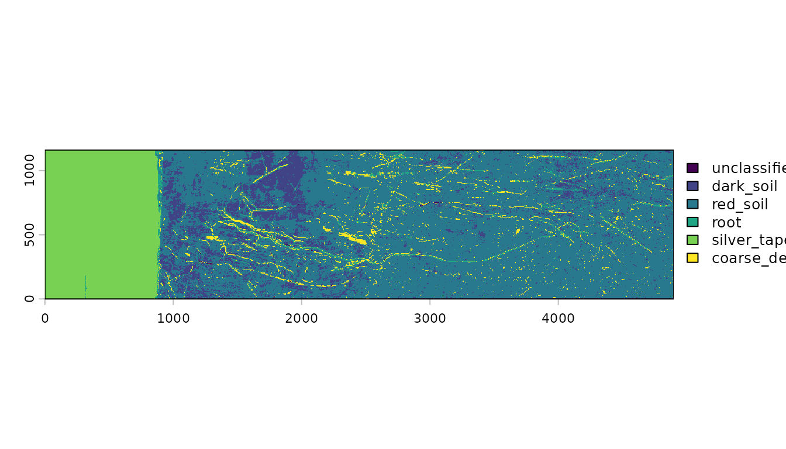
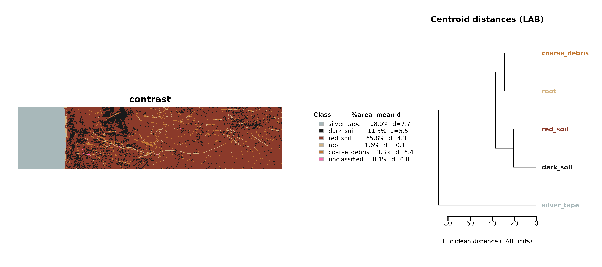
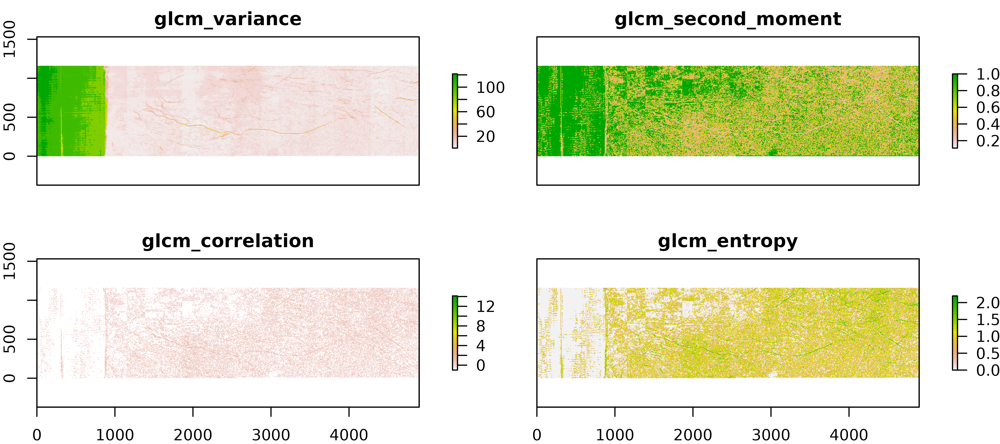
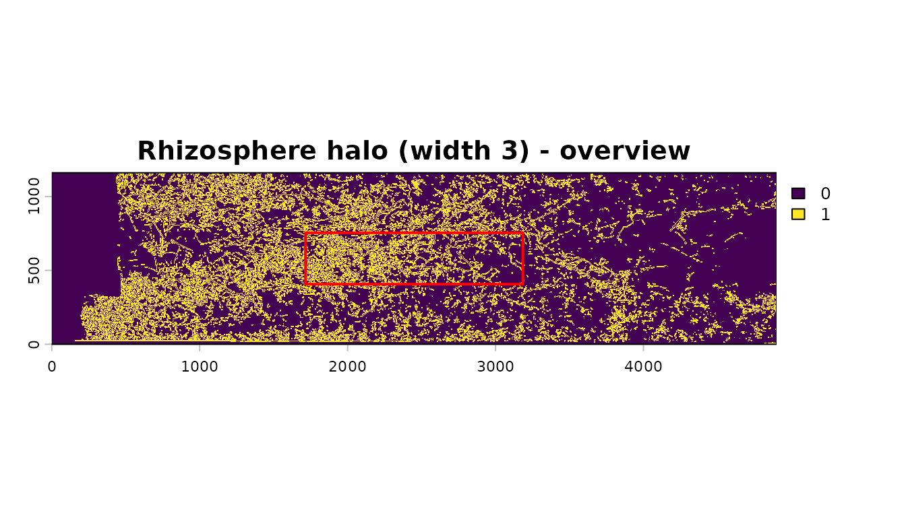
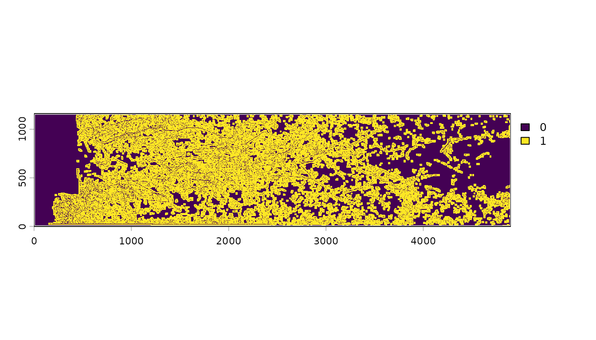
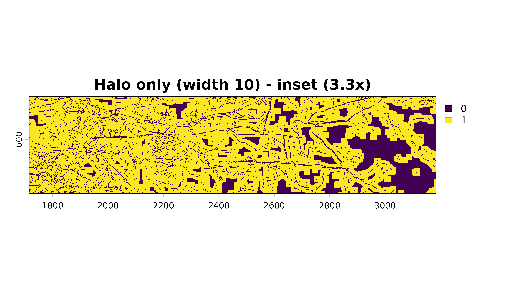

# Special Topics: Soil Color, Soil Texture, Rhizosphere Halos, and Turnover

This article collects a few less-obvious capabilities of **Rootopia**
that do not fit the main step-by-step tutorials but are useful for
specific questions: classifying soil/soil material by color, quantifying
soil surface texture, building a rhizosphere “halo” zone around roots,
and measuring root turnover between time points.

All examples use the bundled Oulanka 2023 example rasters, so you can
run them as-is.

## 1. Soil and material color classification

[`classify_soil_rgb()`](https://jcunow.github.io/Rootopia/reference/classify_soil_rgb.md)
assigns every pixel of an RGB scan to a class (e.g., dark soil, red
soil, root, silver tape, coarse debris, …) by nearest-centroid matching
in CIE LAB color space. Pixels too far from any centroid are left
“unclassified”.

``` r

img <- terra::rast(rgb_Oulanka2023_Session03_T067)

# downsample_fact speeds up the demo; drop it for full resolution
result <- classify_soil_rgb(img, downsample_fact = 4, verbose = FALSE)

# A SpatRaster of class IDs (factor levels are the class names)
terra::plot(result$map)
```



The returned list also carries per-class statistics – pixel counts, area
fractions, mean LAB/RGB colors, and the mean distance to the centroid:

``` r

result$metrics
#>           class n_pixels pct_pixels L_mean A_mean B_mean L_sd A_sd B_sd R_mean
#> 1     dark_soil    40252     11.331    8.8    1.5    2.4 3.38 1.45 1.35   28.3
#> 2      red_soil   233641     65.768   13.9    4.4    5.9 3.55 1.99 2.10   44.2
#> 3          root     5707      1.606   34.5    4.6   10.7 8.19 3.26 5.74   94.7
#> 4   silver_tape    63821     17.965   73.1   -2.0    0.9 3.63 0.55 1.06  176.4
#> 5 coarse_debris    11632      3.274   22.5    7.9   11.9 3.57 2.96 3.39   70.4
#> 6  unclassified      197      0.055   20.1   18.6   22.7 7.00 2.11 4.84   80.2
#>   G_mean B_mean_rgb mean_dist_to_centroid hex_actual
#> 1   23.9       20.9                  5.51    #1C1816
#> 2   33.0       27.1                  4.32    #2C211B
#> 3   78.4       64.6                 10.11    #5F4E40
#> 4  180.6      177.8                  7.67    #B0B5B2
#> 5   49.1       36.5                  6.38    #473124
#> 6   36.5       13.9                    NA    #50240F
```

### Visualizing the classification

[`plot_soil_classification()`](https://jcunow.github.io/Rootopia/reference/plot_soil_classification.md)
renders the class map with a legend and the actual mean colors of each
class:

``` r

plot_soil_classification(result)
```



### Calibrating your own centroids

The default centroids were calibrated on one scanner and site. For other
data, build your own with
[`build_soil_centroids()`](https://jcunow.github.io/Rootopia/reference/build_soil_centroids.md).
You supply `picks`: a named list with one element per material class,
where each element is a matrix with 3 columns (R, G, B in 0-255). Each
row is one color sample for that class — different classes can have
different numbers of rows. The function averages each class’s samples
into a single LAB centroid and returns a table in the same format as the
built-in defaults, ready to pass back into
[`classify_soil_rgb()`](https://jcunow.github.io/Rootopia/reference/classify_soil_rgb.md).

The simplest approach is to read representative RGB values off your scan
with a color picker (e.g. in an image viewer or QGIS) and enter them
directly:

``` r

# each row is one pixel with r,g,b values
picks <- list(
  region1 = matrix(c( 28,  22,  18,
                         32,  26,  21,
                         25,  19,  15), ncol = 3, byrow = TRUE),
  region2  = matrix(c( 80,  45,  35,
                         65,  32,  31), ncol = 3, byrow = TRUE),
  region3      = matrix(c(180, 160, 130,
                       175, 155, 125,
                       185, 165, 135,
                       178, 158, 128), ncol = 3, byrow = TRUE),
  region4      = matrix(c(201, 205, 210,
                       198, 200, 205), ncol = 3, byrow = TRUE)
)

# One MAX_DIST (LAB units, ~10-30) per class -- larger admits more pixels
max_dist <- c(region1 = 14, region2 = 14, region3 = 26,
              region4 = 12)

cents  <- build_soil_centroids(picks, max_dist)   # prints diagnostics
result <- classify_soil_rgb(img, centroids = cents)
terra::plot(result$map)
```

Note: provide a class for **every** material in your scans. Because
classification is nearest-centroid, any material without its own class
is snapped into whichever defined class sits closest.
[`build_soil_centroids()`](https://jcunow.github.io/Rootopia/reference/build_soil_centroids.md)
prints intra-class spread and inter-class distances to help you tune
`MAX_DIST` before running the full classification.

See
[`?classify_soil_rgb`](https://jcunow.github.io/Rootopia/reference/classify_soil_rgb.md)
for the full description of the centroid table format and the
`prior`/`alpha` blending workflow for iterative refinement.

## 2. Soil surface texture and color

[`analyze_soil_texture()`](https://jcunow.github.io/Rootopia/reference/analyze_soil_texture.md)
computes gray-level co-occurrence matrix (GLCM) texture metrics from a
color image, which can be informative on the spatial heterogeneity
within a scan.

``` r

tex <- analyze_soil_texture(
  img,
  grays   = 12,
  window  = c(5, 5),
  metrics = c("variance", "second_moment","correlation","entropy")
)
terra::plot(tex)
```



A simple summary of overall tube color (mean RGB and a single luminance
value) is available via
[`tube_coloration()`](https://jcunow.github.io/Rootopia/reference/tube_coloration.md):

``` r

tube_coloration(img)
#> Some pixels have zero intensity, which may affect color calculations
#>      rcc    gcc   bcc        hue saturation luminosity      red    green
#> 1 0.4117 0.3192 0.269 0.06635659  0.1982295  0.2660763 67.84946 59.75458
#>      blue
#> 1 54.3997
```

## 3. Rhizosphere halo (root buffer zone)

[`create_root_buffer()`](https://jcunow.github.io/Rootopia/reference/create_root_buffer.md)
grows a buffer of a chosen width around every root pixel – a simple
proxy for the rhizosphere / diffusion zone. With `halo_only = TRUE` it
returns only the ring around the roots (excluding the roots themselves).

``` r

seg  <- load_flexible_image(seg_Oulanka2023_Session03_T067, select_layer = 2)
halo <- create_root_buffer(seg, width = 3, halo_only = TRUE, kernel = "circle")
terra::plot(halo)
```



``` r


halo10 <- create_root_buffer(seg, width = 10, halo_only = TRUE, kernel = "circle")
terra::plot(halo10)
```



``` r

halo10 <- create_root_buffer(seg, width = 10, halo_only = FALSE, kernel = "circle")
terra::plot(halo10)
```



The `kernel` argument switches between a `"circle"` (8-neighbor) and a
`"diamond"` (4-neighbor) growth shape, and `width` controls how many
dilation iterations are applied. Set `halo_only = FALSE` to return the
roots plus their buffer as a single filled mask.

## 4. Root turnover between time points

[`root_turnover()`](https://jcunow.github.io/Rootopia/reference/root_turnover.md)
quantifies how much root material was produced, lost, or retained.
`method` selects one of two approaches:

- `"tc"` (Temporal Comparison) – compare two segmented images from
  different sessions. The `tc_method` argument picks how root amount is
  measured: `"kimura"` (root length) or `"rootpx"` (root pixel count).
- `"dpc"` (Decay, Production, Constant) – decompose a single multi-layer
  image produced by RootDetector into decayed, newly produced, and
  unchanged root fractions.

The bundled `TurnoverDPC_data` is a DPC-style image:

``` r

dpc <- terra::rast(TurnoverDPC_data)
root_turnover(dpc, method = "dpc")
#>     tape constant production   decay newgrowth.ratio decay.ratio constant.ratio
#> 1 887012   438681    2770138 3355722          0.8633      0.8844         0.0668
```

For the two-timepoint comparison you would instead pass both sessions:

``` r

s1 <- terra::rast(skl_Oulanka2023_Session01_T067)
s3 <- terra::rast(skl_Oulanka2023_Session03_T067)
root_turnover(s1, s3, method = "tc", tc_method = "rootpx", unit = "cm", dpi = 150, select_layer = 2)
```

## See also

- [`vignette("BatchProcessing_vignette")`](https://jcunow.github.io/Rootopia/articles/BatchProcessing_vignette.md)
  – end-to-end depth profiling.
- [`?classify_soil_rgb`](https://jcunow.github.io/Rootopia/reference/classify_soil_rgb.md),
  [`?build_soil_centroids`](https://jcunow.github.io/Rootopia/reference/build_soil_centroids.md),
  [`?plot_soil_classification`](https://jcunow.github.io/Rootopia/reference/plot_soil_classification.md)
- [`?analyze_soil_texture`](https://jcunow.github.io/Rootopia/reference/analyze_soil_texture.md),
  [`?tube_coloration`](https://jcunow.github.io/Rootopia/reference/tube_coloration.md)
- [`?create_root_buffer`](https://jcunow.github.io/Rootopia/reference/create_root_buffer.md)
- [`?root_turnover`](https://jcunow.github.io/Rootopia/reference/root_turnover.md)
